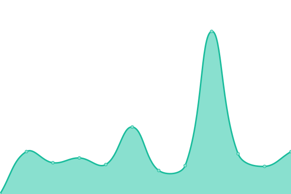
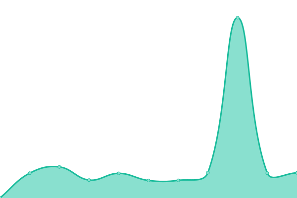
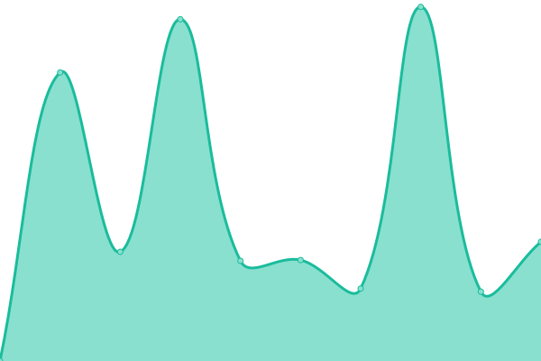
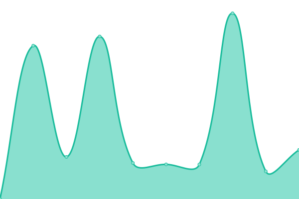

# [📈 Live Status](https://berlinserver.github.io/): <!--live status--> **🟧 Partial outage**

This repository contains the open-source uptime monitor and status page for [berlinserver](https://berlinserver.github.io/)

<!--start: status pages-->
<!-- This summary is generated by Upptime (https://github.com/upptime/upptime) -->
<!-- Do not edit this manually, your changes will be overwritten -->
<!-- prettier-ignore -->
| URL | Status | History | Response Time | Uptime |
| --- | ------ | ------- | ------------- | ------ |
|  [Google](https://www.google.com) | Funcionando (OK) | [google.yml](https://github.com/berlinserver/estatus/commits/HEAD/history/google.yml) | 

 98ms
     
 | 

<a href="https://t1.dapenlinea.com/history/google">100.00%</a>
    

|  [DAP Website](http://web.ula.ve/dap/) | Caida (Error) | [dap-website.yml](https://github.com/berlinserver/estatus/commits/HEAD/history/dap-website.yml) | 

 1649ms
     
 | 

<a href="https://t1.dapenlinea.com/history/dap-website">98.36%</a>
    

|  [SIDAP PROFESORES](http://uladap.adm.ula.ve/sidap/pdi) | Funcionando (OK) | [sidap-profesores.yml](https://github.com/berlinserver/estatus/commits/HEAD/history/sidap-profesores.yml) | 

 1966ms
     
 | 

<a href="https://t1.dapenlinea.com/history/sidap-profesores">98.79%</a>
    

|  [SIDAP](http://uladap.adm.ula.ve/sidap/) | Funcionando (OK) | [sidap.yml](https://github.com/berlinserver/estatus/commits/HEAD/history/sidap.yml) | 

 90ms
     
 | 

<a href="https://t1.dapenlinea.com/history/sidap">98.80%</a>
    

|  [SIDAP RED](http://190.168.72.22/sidap/) | Funcionando (OK) | [sidap-red.yml](https://github.com/berlinserver/estatus/commits/HEAD/history/sidap-red.yml) | 

 178ms
     
 | 

<a href="https://t1.dapenlinea.com/history/sidap-red">99.04%</a>
    

|  [WEB PRINCIPAL DAP](https://dap.ula.ve) | Funcionando (OK) | [web-principal-dap.yml](https://github.com/berlinserver/estatus/commits/HEAD/history/web-principal-dap.yml) | 

 2269ms
     
 | 

<a href="https://t1.dapenlinea.com/history/web-principal-dap">98.83%</a>
    

|  [DAP INTERNACIONAL EEUU](https://dapenlinea.ula.ve) | Funcionando (OK) | [dap-internacional-eeuu.yml](https://github.com/berlinserver/estatus/commits/HEAD/history/dap-internacional-eeuu.yml) | 

 2437ms
     
 | 

<a href="https://t1.dapenlinea.com/history/dap-internacional-eeuu">99.06%</a>
    

|  [ENLACE EXTERNO DAP](http://sistemasdap.ula.ve/) | Funcionando (OK) | [enlace-externo-dap.yml](https://github.com/berlinserver/estatus/commits/HEAD/history/enlace-externo-dap.yml) | 

 1714ms
     
 | 

<a href="https://t1.dapenlinea.com/history/enlace-externo-dap">71.20%</a>
    

<!--end: status pages-->
