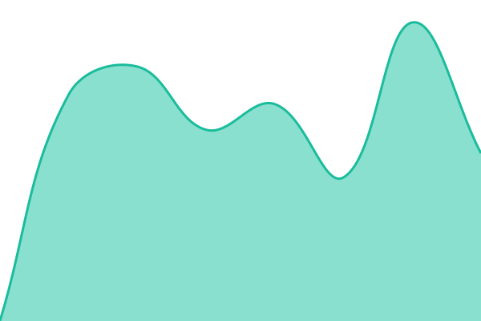
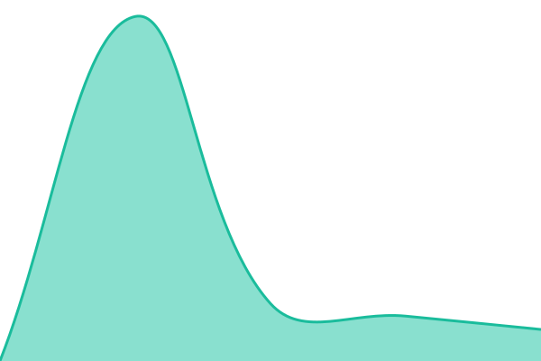
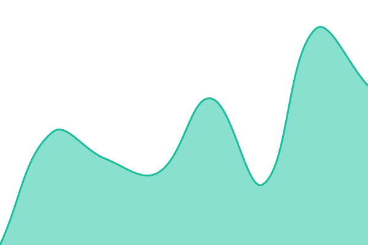

# [📈 Live Status](https://berlinserver.github.io/): <!--live status--> **🟥 Complete outage**

This repository contains the open-source uptime monitor and status page for [berlinserver](https://berlinserver.github.io/)

<!--start: status pages-->
<!-- This summary is generated by Upptime (https://github.com/upptime/upptime) -->
<!-- Do not edit this manually, your changes will be overwritten -->
<!-- prettier-ignore -->
| URL | Status | History | Response Time | Uptime |
| --- | ------ | ------- | ------------- | ------ |
|  [DAP Website](http://web.ula.ve/dap/) | Caida (Error) | [dap-website.yml](https://github.com/berlinserver/estatus/commits/HEAD/history/dap-website.yml) | 

 1085ms
     
 | 

<a href="https://berlinserver.github.io/estatus/history/dap-website">50.98%</a>
    

|  [SIDAP PROFESORES](http://uladap.adm.ula.ve/sidap/pdi) | Caida (Error) | [sidap-profesores.yml](https://github.com/berlinserver/estatus/commits/HEAD/history/sidap-profesores.yml) | 

 1584ms
     
 | 

<a href="https://berlinserver.github.io/estatus/history/sidap-profesores">34.54%</a>
    

|  [SIDAP](http://uladap.adm.ula.ve/sidap/) | Caida (Error) | [sidap.yml](https://github.com/berlinserver/estatus/commits/HEAD/history/sidap.yml) | 

 994ms
     
 | 

<a href="https://berlinserver.github.io/estatus/history/sidap">34.62%</a>
    

|  [SIDAP RED](http://190.168.72.22/sidap/) | Caida (Error) | [sidap-red.yml](https://github.com/berlinserver/estatus/commits/HEAD/history/sidap-red.yml) | 

 225ms
     
 | 

<a href="https://berlinserver.github.io/estatus/history/sidap-red">78.09%</a>
    

|  [WEB PRINCIPAL DAP](https://dap.ula.ve) | Caida (Error) | [web-principal-dap.yml](https://github.com/berlinserver/estatus/commits/HEAD/history/web-principal-dap.yml) | 

 0ms
     
 | 

<a href="https://berlinserver.github.io/estatus/history/web-principal-dap">0.00%</a>
    

<!--end: status pages-->
